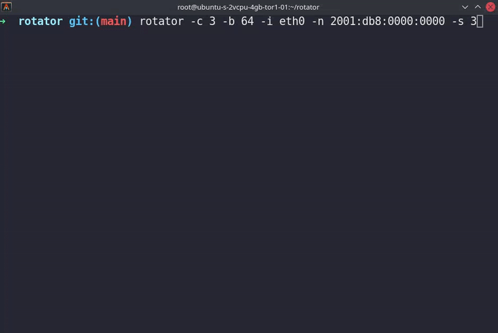

<div align="center">
<h1>rotator</h1>

Rotate over /32 - /48 - /64 CIDR block of IPv6 addresses by randomly generating them.




</div>


---


## Examples

```bash
$ rotator -h
```
---


```s
rotator 0.1
Yagiz Degirmenci. <yagizcanilbey1903@gmail.com>
Rotate IPv6 addresses

USAGE:
    rotator [OPTIONS] --interface <INTERFACE> --network <ADDRESS>

FLAGS:
    -h, --help       Prints help information
    -V, --version    Prints version information

OPTIONS:
    -b, --block <CIDR block>       block range to rotate (Example: 32, 48, 64) [default: 64]
    -c, --count <COUNT>            Number of the addresses to be routed [default: 5]
    -i, --interface <INTERFACE>    Set a network device interface (Example: eth0, ens33)
    -n, --network <ADDRESS>        Address prefix to rotate over. (Example: 2001:db8:0000:0000)
    -s, --sleep <sleep>            Rotate to a new IP in x seconds [default: 10]
```

---

## Installation

Build from the source


rotator is written in [Rust](https://www.rust-lang.org).
You will need rustc version [1.45.0](https://blog.rust-lang.org/2020/07/16/Rust-1.45.0.html) or higher.
The recommended way to install Rust for development is from the [official download page](https://www.rust-lang.org/tools/install), using rustup.

To build, download the source code and run:

```
    $ cargo build
```

---

## Licence

rotator's source code is licenced under the [MIT License](https://www.mit.edu/~amini/LICENSE.md).
